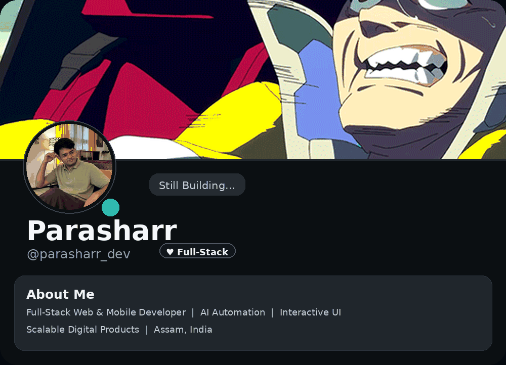
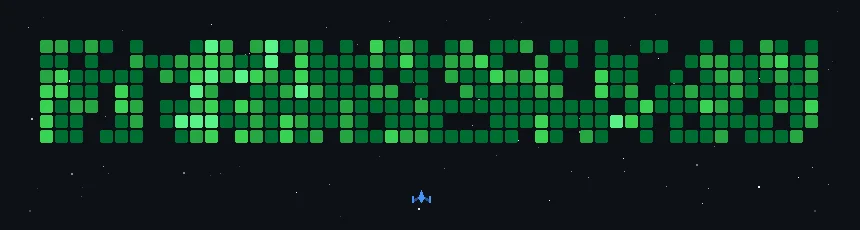

<div align="center">


<br>


<br>

<p>


</p>

<br>

> **I don't just build websites. I build digital products.**

<br>

<a href="https://github.com/parasharr">

</a>

<a href="https://www.linkedin.com/in/pranjeetgoswami">

</a>

<a href="https://www.instagram.com/pranjeet.dev">

</a>

</div>

---

<div align="center">
  
</div>

```ts
const developer = {
  name: "Pranjeet Goswami",
  role: "Co-Founder & Tech Lead",
  company: "Grox Studio",
  location: "Assam, India",

  focus: [
    "Full-Stack Development",
    "Mobile Applications",
    "AI Automation",
    "Interactive UI",
    "Scalable Architecture"
  ],

  currentlyBuilding: [
    "AI-powered workflows",
    "Digital products",
    "Modern web experiences"
  ],

  philosophy: "Ship fast. Build clean. Scale forever."
};
```

---

# 🧠 What I Build

<div align="center">

<table>
<tr>

<td align="center" width="25%">

### 🌐 Web Apps

Modern, responsive and scalable web applications using React & Next.js.

</td>

<td align="center" width="25%">

### 📱 Mobile Apps

Cross-platform applications with Flutter and Dart.

</td>

<td align="center" width="25%">

### 🤖 AI Systems

AI agents, automations and intelligent workflows.

</td>

<td align="center" width="25%">

### ⚡ Experiences

Smooth animations, interactions and high-performance interfaces.

</td>

</tr>
</table>

</div>

---

# 🛠️ Tech Arsenal

<div align="center">

### `LANGUAGES`


<br><br>

### `FRONTEND`


<br><br>

### `BACKEND`


<br><br>

### `DATABASE & CLOUD`


<br><br>

### `TOOLS`


</div>

---

# 🧪 Currently Experimenting With

<div align="center">


</div>

---

# 📊 GitHub Analytics

<div align="center">


</div>

<br>

<div align="center">


</div>


<div align="center">



<br><br>


<br>

### `⚡ CONTRIBUTIONS | TARGETS | CODE | CHAOS ⚡`

</div>

---

# 🌐 Let's Connect

<div align="center">

<a href="https://www.linkedin.com/in/pranjeetgoswami">

</a>

<a href="https://www.instagram.com/pranjeet.dev">

</a>

<a href="mailto:pranjeetgoswami999@gmail.com">

</a>

</div>

<br>

<div align="center">

### ⚡ CODE · DESIGN · AI · SCALE

*"Fast doesn't have to be messy."*

